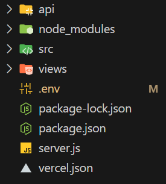
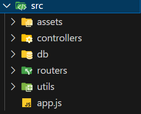
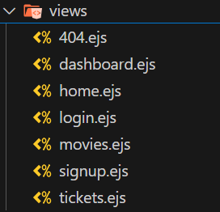
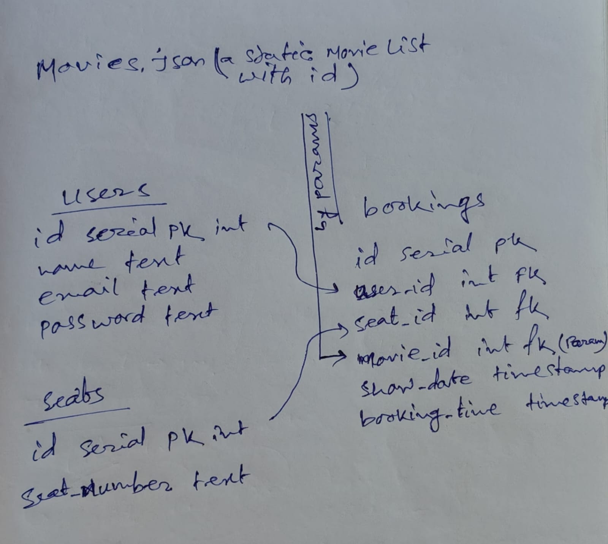
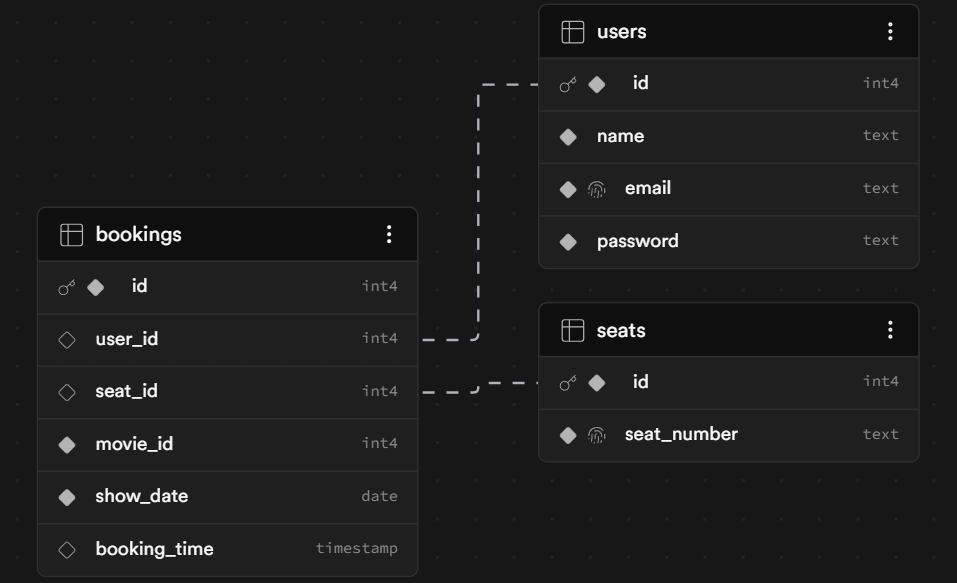
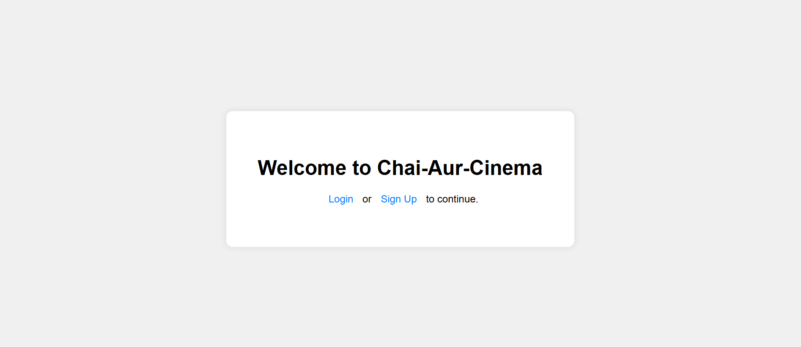
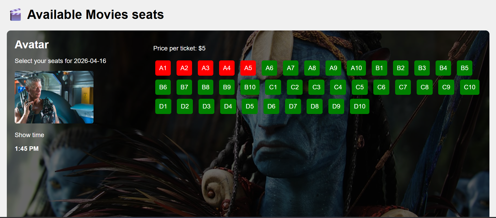

# This is our CHAI-CINEMA-BOOKING System

In this webapp I create a Cinema seat booking system with express, bcrypt, jsonwebtoken, pg (postgres), ejs, cookies, dotenv etc.

* Here you can't booked any seats without logged in our cinema booking system, After register (sign up) anyone can booked the seats. If there any multiple user try to booked i use  **FOR UPDATE** to avoid the conflict.
* There are **users**, **seats** and **bookings** table available in postgressSQL
* The movies are static (that data fetching from movies.json file)

## Folder Structure
* The main folders 

  ### Note:- The **api** and **vercel.json** agnorable because they need for vercel deployment only and when you deploy on vercel there will local .env not worked

* The src folders

* The views folders

## The thought process behind the DB
As i say before, i create three tables in DB... The tables ->

From DB ->

The project Home Page 

[Book your seat](https://chai-cinema-booking.vercel.app/)

The movie seats

